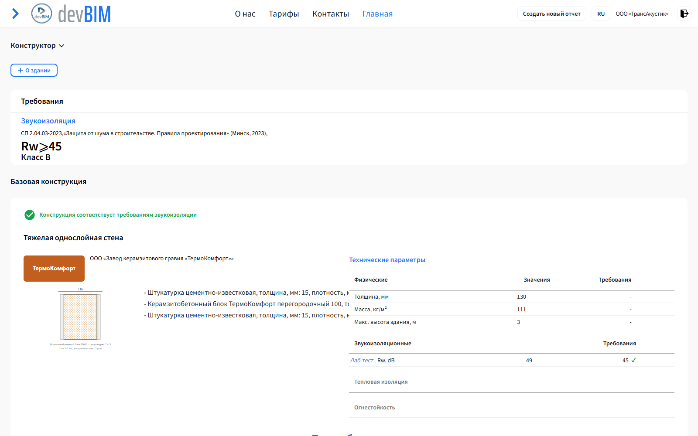
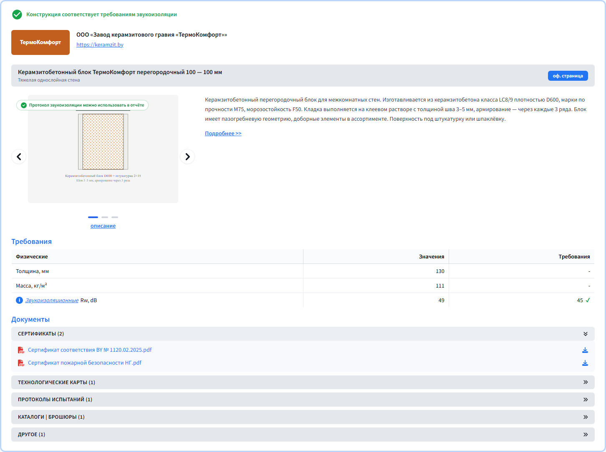
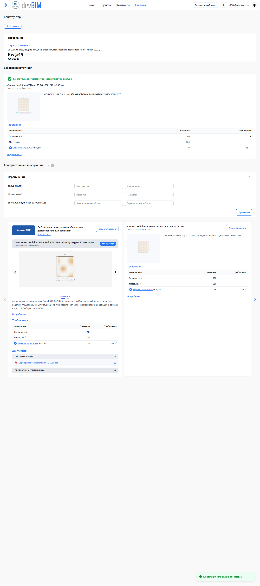

# Карточка конструкции в каталоге: брендовая (платная) и базовая (бесплатная)

Переделка карточек конструкций в каталоге выбора конструкций (экран
«Расчёт» → выбор конструкции) репозитория **TransAcoustic/frontend**.

## Структура репозитория (важно для слияния)

| Ветка | Назначение |
|---|---|
| **`feature/catalog-card-rework`** | **Ветка для слияния** с `TransAcoustic/frontend` (develop): один коммит `4533229` поверх develop `a5e32f7`, только продуктовые правки (`src/` + `package.json`). README и docs/ в неё НЕ входят. |
| `main` | Витрина/документация: тот же код + этот README, ТЗ бэкенду, патчи, скриншоты. **Не для слияния** — используйте для просмотра и ознакомления. |

Демо-обвязка (мок-API, прокси дев-сервера) в продукты **не включена**.

## Было / стало

| | |
|---|---|
| **Было (develop)** |  |
| **Стало — платная (брендовая) карточка** |  |
| **Стало — бесплатная (базовая) карточка** |  |

У каждой конструкции в каталоге два вида карточки:

- **Брендовая** — если размещение оплачено (`isPaidPlacement: true`):
  шапка производителя (логотип, название, сайт с UTM), серая полоса с
  названием и кнопкой «оф. страница», слайдер изображений, описание,
  эмблема **«Протокол звукоизоляции можно использовать в отчёте»**,
  таблица «Требования», аккордеон «Документы» (8 категорий). Карточка
  выделена рамкой `border-[3px] border-primary/30`.
- **Базовая** — если размещение не оплачено (`isPaidPlacement: false`):
  компактная, без брендинга — только разрез, состав, таблица
  «Требования» и «Подробнее». **Вся инженерия сохранена** (расчётчиков
  не ограничиваем) — платным является только «витрина» производителя.

Если флаг от бэкенда не приходит — карточка показывается брендовой
(обратная совместимость, вид не меняется до появления поля в API).
Для базовой карточки фронт **не запрашивает** `GET /api/Issuer/{id}` и
`POST /api/Construction/additionalInfo` (−2 запроса на карточку).

## Изменённые файлы (11)

| Файл | Что |
|---|---|
| `src/features/constructor/presentation/components/construction-pick/construction-card.component.tsx` | основная карточка: брендовая/базовая ветки, слайдер, эмблема протокола |
| `src/features/constructor/presentation/components/construction-pick/alternate-construction-card.component.tsx` | то же для альтернативных конструкций |
| `src/features/constructor/presentation/components/construction-pick/construction-card-sections.component.tsx` | **новый**: общие секции — шапка производителя, серая полоса, таблица «Требования», аккордеон «Документы», базовый вид `CatalogBasicCardView`, хелпер `buildIssuerUrlWithUtm`, эмблема `CatalogReportUsableBadge` |
| `src/features/constructor/presentation/components/construction-pick/build-issuer-url-utm.test.mjs` | **новый**: юнит-тест UTM-хелпера (7 кейсов) |
| `src/features/constructor/presentation/components/construction-pick/construction-filters.component.tsx` | мелкие правки фильтров под новую карточку |
| `src/features/constructor/presentation/components/construction-pick/construction-pick.component.tsx` | мелкие правки страницы выбора |
| `src/features/guidbooks/types/constructions/constructions.types.ts` | тип `isPaidPlacement` |
| `src/features/guidbooks/utils/validation/constructions/constructions.validation.ts` | валидация флага |
| `src/features/guidbooks/converters/constructions/constructions.converter.ts` | конвертер флага |
| `src/features/constructor/converters/report.converter.ts` | флаг для альтернативных конструкций отчёта |
| `src/core/i18n/translations.ts` | ключи EN+RU |

i18n-ключи: `constructor.catalog.officialPage`, `descriptionLink`,
`requirementsTitle`, `reportUsableBadge`, `reportUsableHint`,
`constructor.catalog.documents.*` (8 категорий + заголовок).

## UTM-метки

Все исходящие ссылки производителя (сайт в шапке, кнопка «оф. страница»)
получают `utm_source=devbim&utm_medium=catalog&utm_content=<constructionId>`
без затирания существующих query-параметров и якорей. Логика —
`buildIssuerUrlWithUtm()` в `construction-card-sections.component.tsx`,
покрыта юнит-тестом (`npm run test:utm-helper`, 7 кейсов).

## Как проверить

```bash
npm install
npx tsc --noEmit        # 0 ошибок
npm run test:validation # 8 passed
npm run test:constructions-list # 12 passed
npm run test:pagination # 5 passed
npm run test:utm-helper # 7 passed
```

## Бэкенд-разработчику (обязательно перед выкаткой фронтенда)

Полное ТЗ: [`docs/СПЕКА_бэкенд_карточка_каталога.md`](docs/СПЕКА_бэкенд_карточка_каталога.md).
Фронтенд рассчитывает на три расширения API (все обратно совместимы —
без них карточки работают, но без части функциональности):

1. **`Issuer.Description`** (Изменение 1) — абзац об описании
   производителя в шапке карточки (пока слот свёрстан, данных нет).
2. **`Attachment.Category`** (Изменение 2) — категория документа
   (сертификат/протокол/альбом/…). Пока фронт группирует документы
   эвристикой по имени файла (`DOCUMENT_CATEGORY_PATTERNS`); при
   появлении поля в API эвристика заменяется на него (fallback на
   `category === undefined` остаётся).
3. **Оплата размещения** (Изменение 3) — bool `IsPaidPlacement` либо
   (рекомендуется) дата `PaidPlacementUntil` (NULL = не оплачено,
   дата в будущем = оплачено; авто-деградация карточки по истечении
   срока без модерации). Отсутствие поля = брендовая карточка.

**Готовая реализация P1-части бэкенда уже есть**: ветка
`feature/catalog-placement-backend` (репозиторий TransAcoustic/backend,
от develop `772c5ba`, коммит `a70cbe7`) — `PaidPlacementUntil`,
счётчики `PlacementInteraction` (`POST /api/Placement/interaction`,
`GET /api/Placement/stats`), приоритет выдачи оплаченных. Тот же код
приложен патчем: [`docs/backend-placement.patch`](docs/backend-placement.patch)
(применять в корне backend: `git apply docs/backend-placement.patch`).

## Как слить в основной репозиторий

Сливается ветка **`feature/catalog-card-rework`** (один коммит `4533229`
поверх develop `a5e32f7`; актуальная база — develop не ушёл вперёд,
сверено 29.09.2026, слияние ожидается fast-forward/бесконфликтным):

```bash
# вариант 1 (рекомендуется): merge ветки — в рабочей копии TransAcoustic/frontend
git remote add kartochka https://github.com/devbim26/kartochka_construction.git
git fetch kartochka
git checkout develop
git merge kartochka/feature/catalog-card-rework
# или через PR: ветка feature/catalog-card-rework → develop

# вариант 2: применить патч (без слияния историй)
git apply docs/card-rework.patch
```

> Сливайте именно `feature/catalog-card-rework`, а НЕ `main`: в main
> добавлены README и docs/ этого репозитория-передачи, которые не должны
> попасть в продуктовый репозиторий.

`docs/card-rework.patch` — тот же диф по `src/`, проверен на чистом
develop: `tsc --noEmit` — 0 ошибок, все юнит-тесты зелёные.

Конфликтов с develop не ожидается: правки сконцентрированы в
`construction-pick/` и конвертерах; `webpack.config.js` и прочая
инфраструктура **не тронуты** (демо-прокси в ветку не входит).

---

## Для локального запуска (из исходного README проекта)

1. `npm i`
2. `.env`:

```env
REACT_APP_API_URL = https://192.168.10.23:5001
TEST_SERVER_IP = localhost
TEST_SERVER_PORT = 3000
REACT_APP_MODE = 'development'
```

3. `npm run dev`
